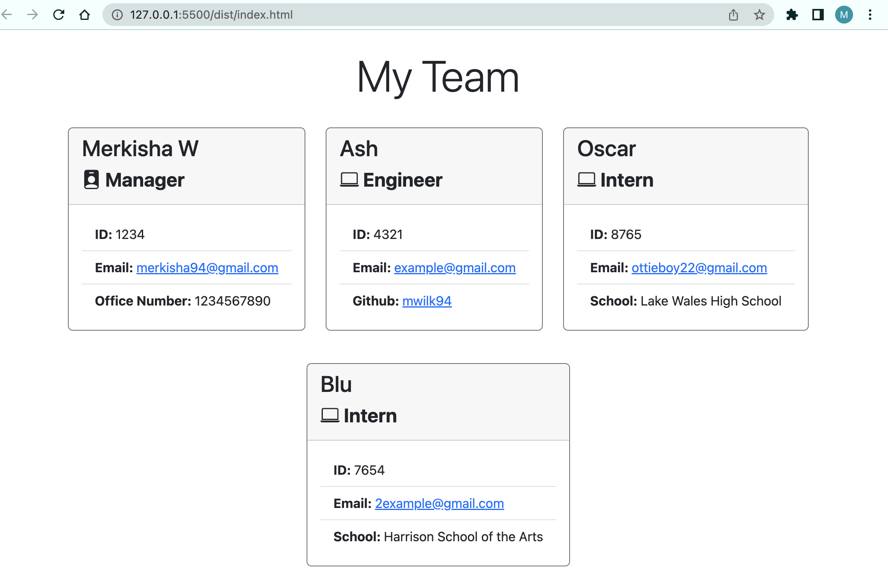

# Team-Profile-Generator

## Table of Contents
- [**Description**](#-description)
- [**Installation**](#-installation)
- [**Usage**](#-usage)
- [**License**](#-license)
- [**Tests**](#-tests)
- [**Questions**](#-questions)
- [**Author**](#-author)

## 📑 Description
As a project manager you may want to organize your team. With this app you will be able to generate a team profile page based on user input using the Inquirer module from Node.js. This will create an HTML displaying the information that was inputed. 

## Installation 
The user should npm i inquire . This application also requires a file system and inquirer module. If testing is required, this application uses Jest. 

## Usage 
Use inquirer from your command line to answer questions about your project.
View walk through video here - [Screencastify](https://drive.google.com/file/d/11qSags7uyEW9uSQSj5QscZqGOxCMKzFC/view) 

## License 
This project is license under MIT

## Tests
Run `npm test` in the terminal to run Jest for tests on constructors. 

## Questions
If you have any questions about this projects, please contact me via email at merkisha94@gmail.com. 

## Author
- Merkisha Wilkinson
    - Email: **merkisha94@gmail.com**
    - Github: [**GitHub**](https://github.com/mwilk94)